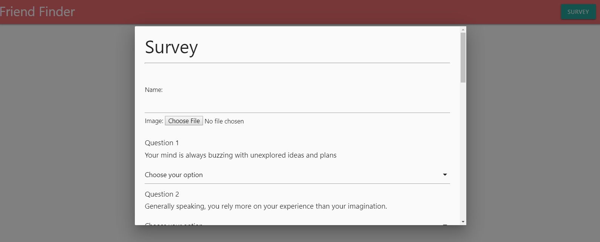
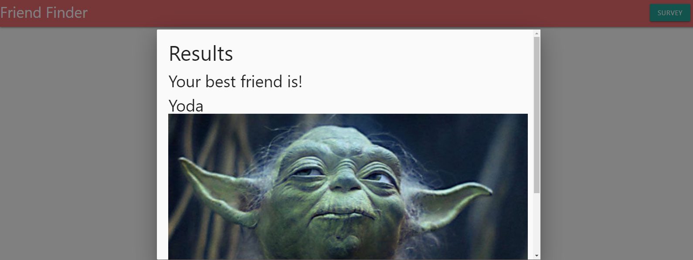

# FriendFinder

This is a friend finder application that demonstrates usage with node.js and express. This application will run to best match you with a database of people to find who you are most compatible with as a friend.
  

*  Examples of using friend finder:

## Usage

This project was completed using Javascript, and Express and can be ran with node.js

## Contributing
Pull requests are welcome. For major changes, please open an issue first to discuss what you would like to change.

Please make sure to update tests as appropriate.

## License

created by kima111